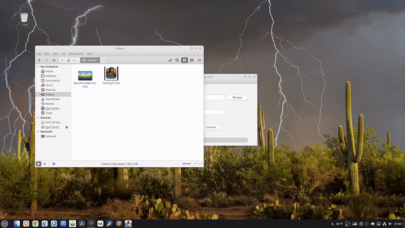

# Domenico 🎞️

**Create GIFs from Video — Instantly. No FFmpeg commands required.**

Domenico is a cross-platform desktop application that lets you create optimized looping animated GIFs from video files using FFmpeg — without needing to remember complex commands.

---

<p align="center">
  
</p>


## 🚀 Features

- 🎬 Convert video clips to animated GIFs
- ⚡ Optimized for short clips (under 10 seconds)
- 🖱 Simple GUI — no command-line knowledge needed
- 🔁 Perfect for tutorials, demos, and social media
- 🐧 Built for Linux

---

## 🧠 Why Domenico?

Creating GIFs with FFmpeg is powerful — but remembering the right commands can be frustrating.

Domenico removes that barrier.

Just select your video, choose your clip, and click convert.

---

## 🎯 Use Cases

- GitHub README animations
- YouTube Shorts previews
- App demonstrations
- Social media content
- Quick tutorials

---

## ⚙️ Requirements

- **FFmpeg must be installed on your system**

Domenico does not bundle FFmpeg — it uses your system installation.

---

## 📦 Installation

Download the latest AppImage from:

👉 https://bytesbreadbbq.com/domenico/

👉 https://github.com/RossContino1/Domenico

Make it executable and run:

```bash
chmod +x Domenico.AppImage
./Domenico.AppImage
